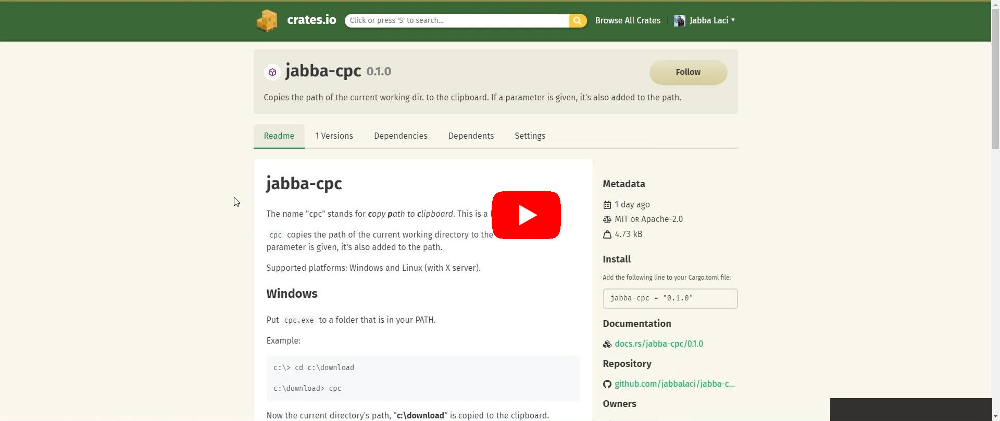

# jabba-cpc

The name "cpc" stands for _**c**opy **p**ath to **c**lipboard_. This is a binary crate.

`cpc` copies the path of the current working directory to the clipboard.
If a parameter is given, it's also added to the path.

Supported platforms: Windows and Linux (with X server).

## Demo

<div align="center">
  <a href="https://www.youtube.com/watch?v=iNdqZzs79FU"></a>
</div>

## Windows

Put `cpc.exe` to a folder that is in your PATH.

Example:

```
c:\> cd c:\download

c:\download> cpc
```

Now the current directory's path, "**c:\download**" is copied to the clipboard.

```
c:\download> cpc tree.jpg
```

Now the absolute path of the given file, "**c:\download\tree.jpg**" is copied to the clipboard.

Help: `cpc.exe -h`

## Linux

`cpc` relies on the external command `xclip` to manipulate the content of the clipboard.
Thus, you must install `xclip` using your package manager (under Ubuntu it's
`sudo apt install xclip`).

Under Linux, there are two clipboards. They are called "primary" and "clipboard". `cpc`
puts the path on both of them, thus you can insert the path with one of the following
methods: Ctrl+v, Shift+Insert, or mouse middle click.

See the example above, it works similarly under Linux.

Help: `cpc -h`
